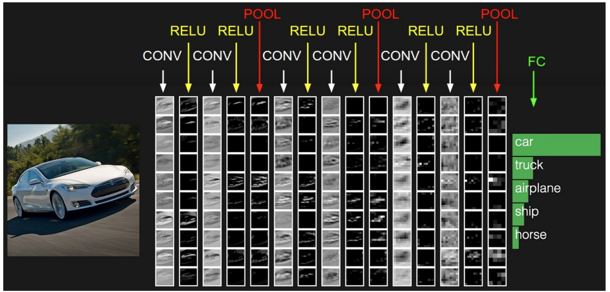

# Card Recognition with Convolutional Neural Networks (CNN)



## Description

Ce projet utilise un réseau de neurones convolutionnel (CNN) pour la reconnaissance de cartes à jouer à partir d'images. Le modèle est entraîné à l'aide de Keras et TensorFlow et l'interface utilisateur est construite avec Tkinter. L'application permet de sélectionner une image à partir de votre système de fichiers et d'obtenir une prédiction sur la carte affichée dans l'image.

## Structure du projet

- train/ # Dossier contenant les images d'entraînement
- valid/ # Dossier contenant les images de validation
- test/ # Dossier contenant les images de test
- card_recognition_model.h5 # Modèle sauvegardé après entraînement, si sauvegardé
- cardReader.py # Script principal pour la reconnaissance de cartes
- README.md # Ce fichier


## Prérequis

- Python 3.7+
- TensorFlow 2.x
- Keras
- Pillow
- OpenCV
- Tkinter

## Installation

1. Clonez ce dépôt :
    ```bash
    git clone git@github.com:Matthieu33197/MiniProjectCardRecognition.git
    cd MiniProjectCardRecognition
    ```

2. Installez les dépendances requises :
    ```bash
    pip install tensorflow pillow opencv-python-headless
    ```

## Utilisation

1. Assurez-vous que vos répertoires `train`, `valid`, et `test` contiennent les images correctement organisées par classe.
2. Lancez le script principal :
    ```bash
    python3 cardReader.py
    ```
3. Une fenêtre Tkinter s'ouvrira. Cliquez sur le bouton **Load Image** pour sélectionner une image de votre système de fichiers.
4. Le modèle chargera l'image, effectuera une prédiction et affichera le nom de la carte dans la console.

## Contribuer

Les contributions sont les bienvenues ! N'hésitez pas à ouvrir une issue ou à soumettre une pull request.